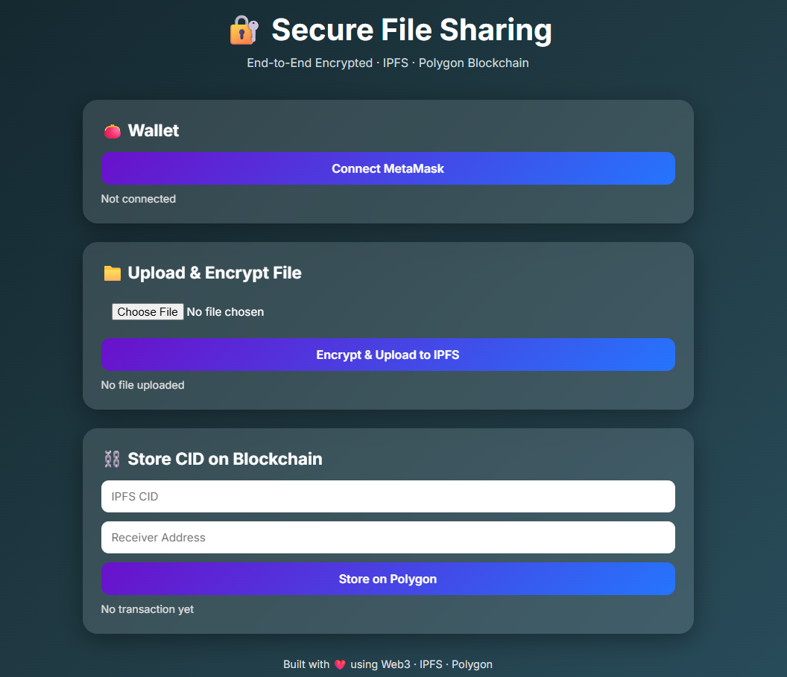
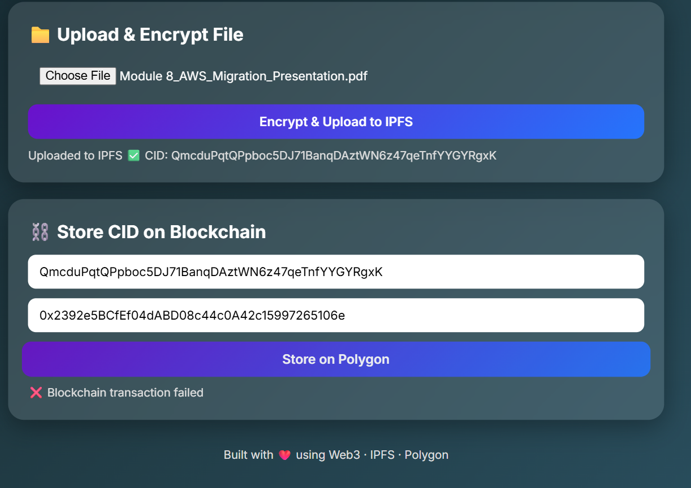
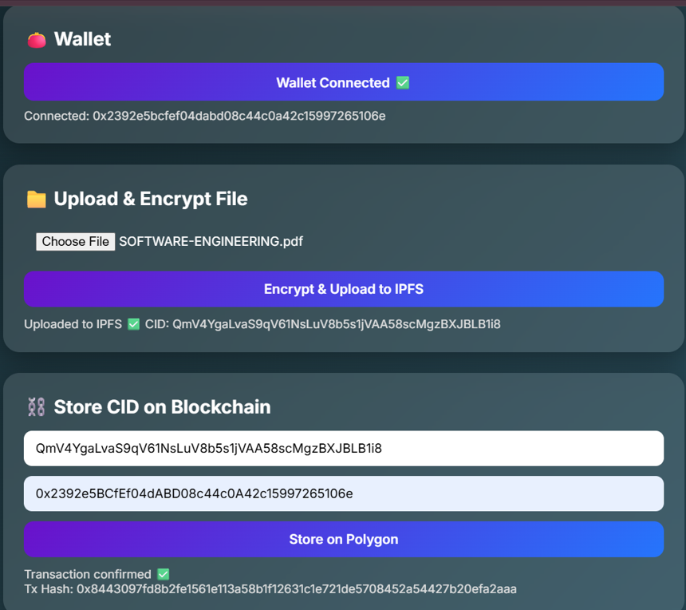

🔐 Secure Decentralized File Sharing System
End-to-End Encrypted · IPFS · Polygon Blockchain

📌 Overview-

This project implements a secure, decentralized file sharing system that enables users to encrypt files locally, store them on IPFS, and record file references securely on the Polygon blockchain.
The system ensures data privacy, integrity, and decentralization by eliminating centralized servers and using blockchain-based access control.

🚀 Key Features-

🔐 End-to-End Encryption (Client-side AES encryption)

📦 Decentralized Storage using IPFS (Pinata)

⛓️ Blockchain-based Metadata Storage on Polygon

👛 MetaMask Wallet Integration

🖥️ Modern Web3 UI (No backend server)

🛡️ No Central Point of Failure

🧠 System Architecture-

User Browser
↓
Encrypt File (AES)
↓
Upload Encrypted File → IPFS
↓
Get CID (Content Identifier)
↓
Store CID on Polygon Smart Contract

🛠️ Tech Stack-

Layer Technology
Frontend HTML, CSS (Glassmorphism), JavaScript
Web3 ethers.js
Wallet MetaMask
Blockchain Polygon Amoy Testnet
Storage IPFS (Pinata)
Encryption AES (Client-side)

📂 Project Structure
secure-decentralized-file-sharing/
│
├── blockchain/
│ └── FileStorage.sol
│
├── encryption/
│ ├── encryptFile.js
│ ├── decryptFile.js
│ └── keys/
│
├── ipfs/
│ ├── uploadToIPFS.js
│ └── downloadFromIPFS.js
│
├── ui/
│ ├── index.html
│ ├── style.css
│ └── app.js
│
├── package.json
├── .gitignore
└── README.md

🔑 Smart Contract Details-

Contract Name: FileStorage

Network: Polygon Amoy Testnet

Purpose: Stores IPFS CIDs with owner and receiver addresses

Core Functions-

uploadFile(string cid, address receiver)

getFile(uint256 fileId)

🌐 Deployment Details-

Replace these with your actual values

Network: Polygon Amoy Testnet

Contract Address: 0x649c35347fE4b2AA984e5282dD0def8CF4827D5D

Deployment Transaction: 0x3b0773097a030a066e576082c1a48edf9b1ea9672b9830aca1cb79a9b2e92c87

🖥️ User Interface-

The application includes a clean, modern Web3 interface that allows users to:

Connect MetaMask wallet

Upload and encrypt files

Upload encrypted files to IPFS

Store IPFS CID on the blockchain

View transaction confirmation

📸 Screenshots-

Upload & Encrypt

Final

🔐 Security Design-

Files are encrypted before leaving the user’s device

Encryption keys are never stored on-chain

Only IPFS CID (hash) is stored on blockchain

No centralized backend or database

Users retain full ownership of data

⚠️ Environment & Security Notes-

API keys and JWTs are not committed to this repository

Users must add their own Pinata JWT locally

.env and sensitive files are excluded via .gitignore

🎓 Academic Relevance-

This project demonstrates:

Practical application of Blockchain & Web3

Use of Decentralized Storage

Secure cryptographic file handling

Real-world DeFi / DApp architecture

📈 Future Enhancements-

File sharing permissions & revocation

File decryption UI

User file history dashboard

Support for multiple receivers

Frontend key management improvements

👨‍💻 Author-

Viraj Rai
Blockchain & Web3 Project
Academic Major Project

⭐ Final Note-

This project is a fully functional decentralized application showcasing secure file sharing using modern Web3 technologies.
